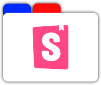
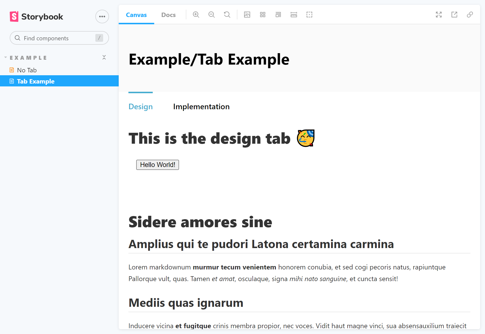

<p align="center">
  
</p>

## storybook-addon-docs-tabs

A [Storybook](https://github.com/storybooks/storybook) addon that adds tabs to the [Docs Addon](https://github.com/storybookjs/storybook/tree/next/addons/docs).

_Note: This addon is a little bit hacky. The storybook api does not support something like this at all. But you can still use this addon because it is still using mdx and its "normal" api._

<p align="center">
  
</p>

## Getting started

### 1. Install

```sh
npm install --save-dev storybook-addon-designs
# yarn add -D storybook-addon-designs
```

### 2. Add new Container to `.storybook/preview.js`

```js
import { DocsContainer } from "@storybook/addon-docs/blocks";
import TabContainer from "../src/TabContainer";

export const parameters = {
  docs: {
    container: ({ children, context }) => (
      <DocsContainer context={context}>
        <TabContainer context={context}>{children}</TabContainer>
      </DocsContainer>
    ),
  },
};
```

### 2. Hide Tab Stories from the sidebar in `.storybook/manager-head.html`

```html
<style>
  [id^="hidden"],
  [data-parent-id^="hidden"] {
    display: none !important;
  }
</style>
```

### 3. Add jsx in `.storybook/tsconfig.json`

**Optional: If you havent configured jsx**

```json
{
  "extends": "../tsconfig.app.json",
  "compilerOptions": {
    "jsx": "react"
  }
}
```

### 4. Add react preset in `.storybook/.babelrc`

**Optional: If you havent configured jsx**

```json
{
  "presets": [["@babel/react", { "runtime": "automatic" }]]
}
```

## Usage in story

### Set id of story

Unfortunately this is necessary because of the limited Storybook api. Any unique string can be used as id.

Prefix the stories title with `hidden/` to hide it in the sidebar.

```mdx
import { Story, Meta, ArgsTable, Source } from "@storybook/addon-docs";

<Meta
  id="simple-button-implementation"
  title="hidden/SimpleButtonImplementation"
  component={TestComponent}
/>
```

### Import Tabs

```mdx
import { Meta } from "@storybook/addon-docs";
import * as DesignTab from "./design-tab.stories.mdx";
import * as ImplementationTab from "./implementation-tab.stories.mdx";

<Meta
  title="Example/Tab Example"
  parameters={{
    tabs: [
      { label: "Design", mdx: DesignTab },
      { label: "Implementation", mdx: ImplementationTab },
    ],
  }}
/>
```

## Add Header CTA and Footer

You can extend the TabContainer with a custom call to action and a custom footer which is displayed on every page.

| property                | input type  | description                                                 |
| ----------------------- | ----------- | ----------------------------------------------------------- |
| footerElement           | JSX.Element | Displays your component on every page bottom                |
| additionalHeaderElement | JSX.Element | Displays your component inside the header next to the title |

### Example

```jsx
{container: ({ children, context }) => (
  <DocsContainer context={context}>
    <TabContainer
      context={context}
      footerElement={<Footer />}
      additionalHeaderElement={<Header />}
    >
      {children}
    </TabContainer>
  </DocsContainer>
)},
```
